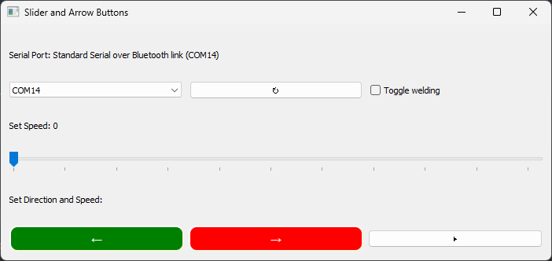

# Welding Carriage Control

A **software + hardware control system for a motorized welding carriage**, designed for controlled linear travel during welding operations.

The system combines a desktop control interface with an **XIAO ESP32-S3**, **BTS7960 motor driver**, and **24V DC motors** to provide directional control, variable-speed operation, and programmable carriage movements.

---

## Features

* ↔️ **Forward / reverse direction control**
* ⚡ **Variable motor speed using PWM**
* 📏 **Pre-programmed movements for known travel distances**
* 🎛️ **Desktop GUI for carriage control**
* 🔌 **Relay output control for external devices**
* 🛑 **Controlled start / stop operation**
* 🔧 Designed for integration with **welding and automation systems**

---

## 🎥 Working Demo

https://github.com/curi0sity722/carriage-control-/blob/main/video_demo/carriage_working.mp4

## 📁 Project Structure

```text
carriage-control/
│
├── carriage_control_UI.png
├── carriage_control_v2.py
├── README.md
│
├── mcu_code/
│   └── MOTOR_DRIVER_V2.ino
│
└── video_demo/
    ├── carriage_testing.mp4
    └── carriage_working.mp4
```

---

## System Architecture

```text
┌─────────────────────────┐
│      Python GUI         │
│  carriage_control_v2.py │
└────────────┬────────────┘
             │
             │ Control Commands
             ▼
┌─────────────────────────┐
│     XIAO ESP32-S3       │
│   MOTOR_DRIVER_V2.ino   │
└────────────┬────────────┘
             │
             │ PWM / Direction
             ▼
┌─────────────────────────┐
│       BTS7960           │
│     Motor Driver        │
└────────────┬────────────┘
             │
             ▼
┌─────────────────────────┐
│       24V DC Motors     │
│    Welding Carriage     │
└─────────────────────────┘
```

---

## UI Preview



The Python application provides the operator interface for controlling carriage direction, speed, travel distance, and auxiliary outputs.

---

## Hardware

| Component        | Description                      |
| ---------------- | -------------------------------- |
| **Controller**   | XIAO ESP32-S3                    |
| **Motor Driver** | BTS7960 high-power H-bridge      |
| **Motors**       | 24V DC motors, ~200 mA each      |
| **Power Supply** | WX-DC2412, 24V / 4A              |
| **Relay Module** | HL-52S, 2-channel 24V relay      |
| **Application**  | Python desktop control interface |

---

## Motor Control

The carriage uses **PWM-based speed control**.

The ESP32-S3 generates the PWM control signal, which is applied to the BTS7960 motor driver. Direction control is achieved through the driver's H-bridge configuration.

This allows the carriage to operate at different travel speeds while maintaining software-controlled direction.

```text
Python GUI
    │
    │ Speed / Direction
    ▼
ESP32-S3
    │
    │ PWM + Direction
    ▼
BTS7960
    │
    │ 24V Motor Power
    ▼
DC Motors
```

---

## Programmable Travel

The system supports **pre-programmed carriage movements** for applications where a known travel distance is required.

This can be used for repeatable operations such as:

* Welding passes
* Linear travel experiments
* Automated carriage positioning
* Repeatable testing
* Process development

---

## Relay Control

A two-channel **HL-52S relay module** provides additional outputs that can be used to trigger external equipment.

Possible applications include:

* Welding equipment trigger
* Auxiliary actuators
* External process control
* Custom automation signals

The relay functionality can be adapted according to the requirements of the welding setup.

---

## Software

### Python Application

**`carriage_control_v2.py`**

The Python application provides the operator-facing control interface.

Responsibilities include:

* Carriage direction control
* Speed control
* Movement commands
* Pre-programmed travel
* Relay control
* Serial communication with the ESP32-S3

### ESP32 Firmware

**`MOTOR_DRIVER_V2.ino`**

The ESP32-S3 firmware handles the low-level hardware control.

Responsibilities include:

* PWM generation
* Motor direction control
* Motor driver interface
* Relay outputs
* Receiving commands from the Python application

---

## Demonstration

### Carriage Testing

A test recording demonstrating the carriage control system during testing.

▶️ **[Watch `carriage_testing.mp4`](carriage_testing.mp4)**

---

## Getting Started

### 1. Clone the repository

```bash
git clone https://github.com/curi0sity722/carriage-control-.git
cd carriage-control-
```

### 2. Python application

Install the required Python dependencies:

```bash
pip install -r requirements.txt
```

> If a `requirements.txt` file is not yet included, add the Python packages used by `carriage_control_v2.py` before publishing the repository.

Run the application:

```bash
python carriage_control_v2.py
```

### 3. ESP32 Firmware

Open:

```text
MOTOR_DRIVER_V2.ino
```

in the Arduino IDE and upload it to the **XIAO ESP32-S3**.

Configure the serial port in the Python application according to the connected ESP32.

---

## Application

The system is intended as a building block for **automated welding and linear-motion applications**, where repeatable carriage movement and controlled travel speed are required.

The architecture separates:

**High-level control**

```text
Python GUI
```

from:

**Low-level hardware control**

```text
ESP32-S3 → BTS7960 → DC Motors
```

This makes the system easier to modify and extend for additional automation features.

---

## Future Improvements

Potential extensions include:

* Position feedback using an encoder
* Closed-loop speed control
* Automatic welding sequence control
* Real-time carriage position tracking
* Acceleration / deceleration profiles
* Limit-switch integration
* Emergency-stop input
* Weld-machine synchronization
* Recipe-based welding parameters
* Data logging and process monitoring

---

## License

This project is provided for **engineering, development, and experimental purposes**.

Add an appropriate license here if you intend to make the project open source.
